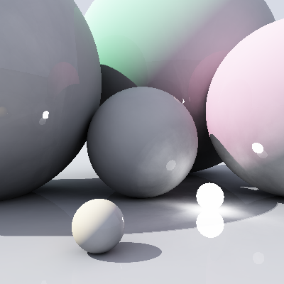

# Synopsis

A toyest raytracer just for fun. Current speed is approx 1M rays per sec on default scene.

# Description

For usage see:

``` bash
$ tracy --help
```

Scene configuration:

* By default, if you do not specify a scene it's taken from here: _src/Tracy/Scene.hs_
* So, the _default scene_ is an example of basic scene as well.

# Examples

This picture is obtained with the following args:

``` bash
$ tracy --size=400x400 --samples=1000 --depth=3 --output=examples/400x400-1000-3.bmp
```



How this image is generated:

* __Depth 1__: Find diffuse color by tracing to all light sources. To find ambient color (or indirect lighting) we should throw 1K rays as specified by ```--samples=1000```
* __Depth 2__: Same procedure as in _Depth 1_, but now we throw just _sqrt 1000_ rays.
* __Depth 3__: Since depth is 3 now we just return diffuse color of a point.

Reflections are computed similarly. I hope it's clear now what does mean that options.

# Build Status

[](https://travis-ci.org/pxqr/tracy)

# Future

Nope, there are no such thing.
